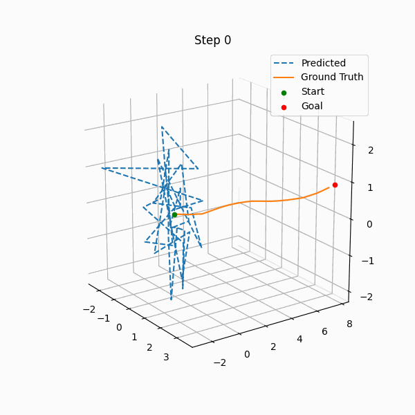

# DiffusionPolicy4Drone

Vision-conditioned Diffusion Policy for **3D UAV trajectory planning**.

This project trains a diffusion model to generate full 3D waypoint trajectories from:

- Depth image observation
- Goal position in 3D space

The model predicts a fixed-length trajectory (default: 32 waypoints) conditioned on perception and target.

---

## Overview

We formulate UAV trajectory planning as a **conditional diffusion problem**:

$$
\epsilon_\theta(x_t, t, \text{cond})
$$

where:

- `x_t` = noisy trajectory
- `t` = diffusion timestep
- `cond` = visual feature + goal

The model learns to predict the added Gaussian noise (DDPM formulation).

---

## Model

- Vision encoder: ResNet18 (BatchNorm replaced with GroupNorm)
- Noise predictor: 1D Conditional U-Net
- Diffusion scheduler: DDPM (`squaredcos_cap_v2`)
- Training objective: MSE between predicted and true noise
- EMA applied during training

---

## Dataset Format

The dataset format is **compatible with iPlanner**.  
Please follow iPlanner’s **data collection** pipeline and directory layout:

- iPlanner repo: https://github.com/leggedrobotics/iPlanner.git  
- Refer to iPlanner documentation/code for **how to record trajectories and sensor streams**.

Each environment folder should contain:
```
<dataset>/
├── depth/
│ ├── 0.png
│ ├── 1.png
│ └── ...
├── odom_ground_truth.txt
```

### Data Requirements

- Depth images must be integer-indexed (`0.png`, `1.png`, ...)
- `odom_ground_truth.txt` contains one 7D pose per line
- Trajectories are constructed as relative poses
- Only xyz components are used for training

Each training sample contains:
(image, goal_xyz, trajectory_xyz[32, 3])


---

## Training

Main settings:

- Prediction horizon: 32
- Diffusion steps: 100
- Optimizer: AdamW
- Scheduler: cosine with warmup
- EMA enabled

Run:

```bash
python train.py
```

## Validation
The validation script performs reverse diffusion and visualizes predicted trajectories against ground truth.



## Acknowledgements
* Dataset format and collection from iPlanner: https://github.com/leggedrobotics/iPlanner.git
* Diffusion training framework adapted from Diffusion Policy: https://github.com/real-stanford/diffusion_policy.git


This repository serves as a research prototype for diffusion-based motion planning. If you are interested in extending this work or conducting joint research, feel free to open an issue or reach out.

If you find this project useful, consider starring the repository ⭐
